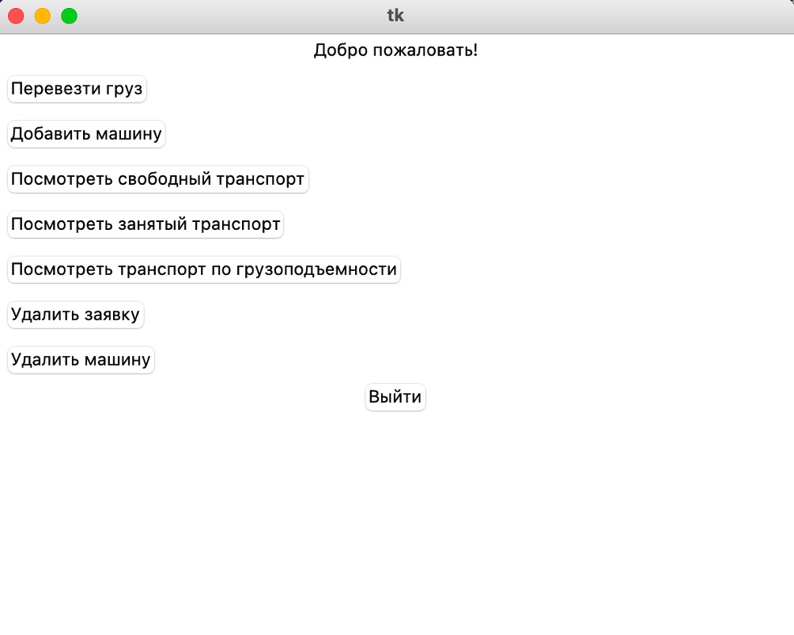

# LogisticsHaul

--- 
## Описание проекта

LogisticsHaul - это программное обеспечение учета грузового транспорта для отдела логистической компании.  
Данная система предоставляет возможность учета грузового транспорта, а также отслеживания заявок на перевоз груза и контроля за перевозками.   

## Установка и использование

Единственный модуль, который необходимо будет установить дополнительно - peewee.  

```bash
pip3 install peewee
```

Далее необходимо запустить файл "main.py"

```bash
python3 main.py
``` 

## Функции и возможности

Используя программное обеспечение LogisticsHaul вы можете:
- Подобрать доступный грузовой транспорт в зависимости от веса груза;
- Добавлять/удалять грузовой транспорт;
- Просматривать весь грузовой транспорт;
- Просматривать грузовой транспорт по грузоподъемности;
- Вносить заявку на перевоз груза;
- Подобрать и забронировать грузовой транспорт.  

Все данные хранятся в БД с помощью ORM системы - peewee, графический интерфейс реализован с помощью модуля tkinter, также предусмотрен отлов возможных ошибок.

Интерфейс главной страницы


Отлов ошибки неправильно введеного номера заявки


